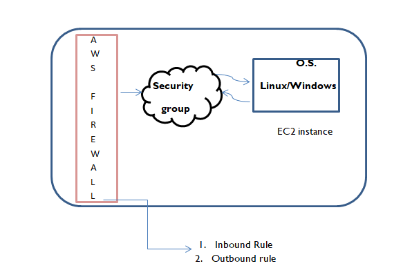
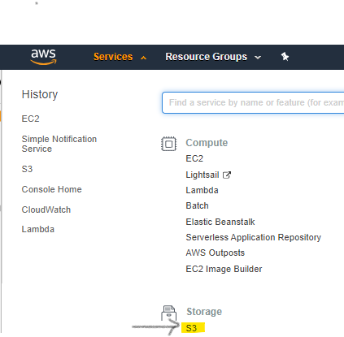
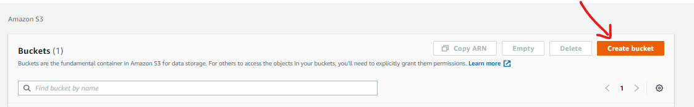
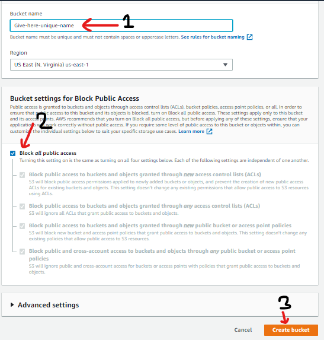
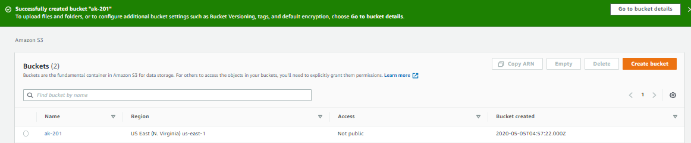

# Level  of abstraction 

#### SAAS- Software as a service
        o	 Cloud/vendor provides software as a service.
        o	E.g. tableau, splank,storm
#### PAAS – platform as a service
        o	Developer facing services
        o	E.g. hosted database
#### IAAS – infrastructure as a service
        o	Raw computing resources
        o	E.g. EC2,disk volume.
        
## Security        

Security group is just like firewall which have inbound and outbound rules 
which defines different port for different services and how access to be given to EC2.

## S3 – storage engine
S3 service is not only provide storage space but it can be used for various other purposes like web hosting .
To use S3 we need to create Bucket inside S3 service. 

---
### How to create S3 Bucket ?
---

#### follow steps 
###### `1. Click on service dropdown then click on S3`

###### `2. Click on 'create bucket' option`

###### `3. Give unique name to your S3 bucket --> Block access -->> create bucket`

###### `4. Done !!`

